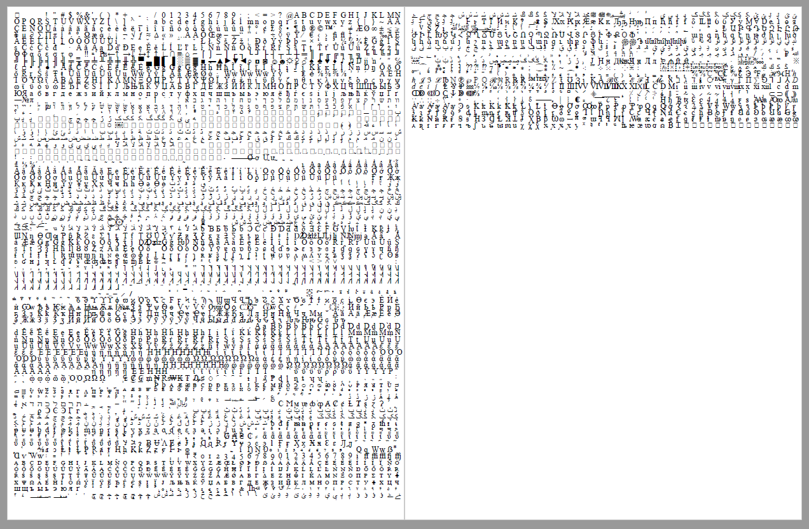

# PDF font embedder

The two simple Python scripts convert standard TrueType/OpenType/Type1 font files to PDF documents, which include the font data in verbatim and display all of their glyphs. The tools are designed to facilitate the testing (e.g. fuzzing) of font rasterization engines used by PDF readers. They were tested on Adobe Acrobat Reader DC, Foxit Reader and Google Chrome.

The `ttfotf_to_pdf.py` script should be used for TTF/OTF files, while `type1_to_pdf.py` works with Type 1 PostScript fonts (`.pfb` extension). Both of them require the [fontTools](https://github.com/fonttools/fonttools) package to be installed in the system to work correctly, in order to extract the number of glyphs in the font.

## Usage

Just pass the path of the font as the first argument and path of the output PDF as the second:

```
c:\font2pdf>python ttfotf_to_pdf.py C:\Windows\Fonts\times.ttf test.pdf
Glyphs in font: 4635
Generated pages: 2

c:\font2pdf>
```

and enjoy the generated document:



