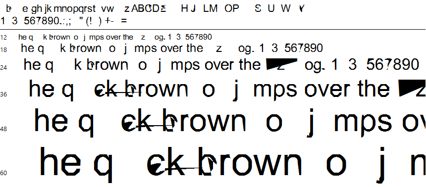

# TrueType program generator

This Python script generates random streams of TrueType instructions, and embeds them into `.ttf` files converted to the XML format (`.ttx`) by [fonttools](https://github.com/fonttools/fonttools). It is useful in identifying complex vulnerabilities in TrueType *virtual machines*, which are triggered through a series of consecutive non-standard instructions and thus can't be otherwise detected through small modifications in legitimate TrueType programs.

The random instructions are inserted into the `prep` table (i.e. the *[control value program](https://docs.microsoft.com/en-us/typography/opentype/spec/prep)*), and into the programs associated with all glyphs present in the font (the `glyf` table). A few values in other tables (mostly `cvt` and `maxp`) are also modified, in order to unify some limits declared by the font and make sure that the TrueType virtual machine doesn't bail out early.

## Usage
Suppose we want to run the tool against an existing file on disk, `arial.ttf`. First, we must [install fonttools](https://github.com/fonttools/fonttools#installation) to be able to use the `ttx` compiler/decompiler:

```
C:\truetype-generator>pip --no-cache-dir install fonttools
Collecting fonttools
  Downloading https://files.pythonhosted.org/packages/9c/0d/d562e2491c579dffb6e0d6a7fa082ad5bc2fede46380d71e91e146a10bd7/fonttools-3.28.0-py2.py3-none-any.whl (609kB)
    100% |UUUUUUUUUUUUUUUUUUUUUUUUUUUUUUUU| 614kB 1.0MB/s
Installing collected packages: fonttools
Successfully installed fonttools-3.28.0
```

Then, we can convert `arial.ttf` to `arial.ttx`:

```
C:\truetype-generator>ttx arial.ttf
Dumping "arial.ttf" to "arial.ttx"...
Dumping 'GlyphOrder' table...
Dumping 'head' table...
Dumping 'hhea' table...
[...]
Dumping 'JSTF' table...
Dumping 'meta' table...
Dumping 'DSIG' table...

C:\truetype-generator>
```

Now, we can run the script to create a new, mutated font. We recommend using 100000 as the total number of inserted TrueType instructions:

```
C:\truetype-generator>python truetype_generate.py arial.ttx output.ttx 100000

C:\truetype-generator>
```

At this point, the `output.ttx` file should contain long streams of TrueType programs, e.g.:

```
[...]
  <prep>
    <assembly>PUSH[ ]
        31597
        SCVTCI[ ]
        PUSH[ ]
        1
        SZP1[ ]
        SFVTPV[ ]
        PUSH[ ]
        20232
        NROUND[01]
        POP[ ]
[...]
```

The last step is to "compile" the XML file back to binary form, like so:

```
C:\truetype-generator>ttx output.ttx
Compiling "output.ttx" to "output.ttf"...
Parsing 'GlyphOrder' table...
Parsing 'head' table...
Parsing 'hhea' table...
[...]
Parsing 'JSTF' table...
Parsing 'meta' table...
Parsing 'DSIG' table...

C:\truetype-generator>
```

The `output.ttf` font is now ready to be used for testing, for example with the [font loader for Windows](../ttf-otf-windows-loader). When writing this tutorial, the resulting file took the following form:


