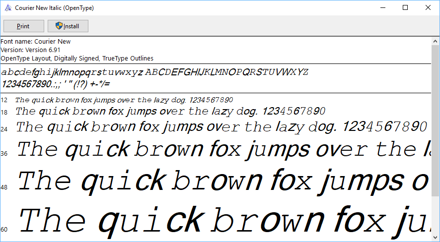

# Font loader for the Windows Font Subsetting Library (FontSub.dll)

The loader is designed to load font files using the [FontSub](https://docs.microsoft.com/en-us/windows/win32/api/fontsub/) library, and test its robustness against malformed input. The library is used to subset fonts while printing documents via Direct2D, which is the case e.g. in Microsoft Edge. Both the [CreateFontPackage](https://docs.microsoft.com/en-us/windows/win32/api/fontsub/nf-fontsub-createfontpackage) and [MergeFontPackage](https://docs.microsoft.com/en-us/windows/win32/api/fontsub/nf-fontsub-mergefontpackage) API functions are tested by the harness.

## Building

The application can be compiled with Microsoft Visual Studio after importing `ttf-fontsub-loader.cpp` into a new project.

## Usage

Using the tool is as simple as passing the path of the tested TTF font in the first argument, for instance:

```
c:\ttf-fontsub-loader>ttf-fontsub-loader.exe C:\Windows\Fonts\arial.ttf
[+] CreateFontPackage([ 1027192 bytes ], TTFCFP_SUBSET1) ---> 0 (390020 bytes)
[+] MergeFontPackage(NULL, [ 390020 bytes ], TTFMFP_SUBSET1) ---> 0 (505796 bytes)
[+] CreateFontPackage([ 1027192 bytes ], TTFCFP_DELTA) ---> 0 (1416 bytes)
[+] MergeFontPackage([ 505796 bytes ], [ 1416 bytes ], TTFMFP_DELTA) ---> 0 (505796 bytes)
[+] CreateFontPackage([ 1027192 bytes ], TTFCFP_DELTA) ---> 0 (1416 bytes)
[+] MergeFontPackage([ 505796 bytes ], [ 1416 bytes ], TTFMFP_DELTA) ---> 0 (505796 bytes)

c:\ttf-fontsub-loader>
```

More runtime information is printed if the program is compiled in Debug mode. During fuzzing, we recommend enabling [Page Heap](https://docs.microsoft.com/en-us/windows-hardware/drivers/debugger/gflags-and-pageheap) for the loader process, for better detection of out-of-bounds and uninitialized memory bugs.

An example of a subsetted Courier New Italic font is shown below:



