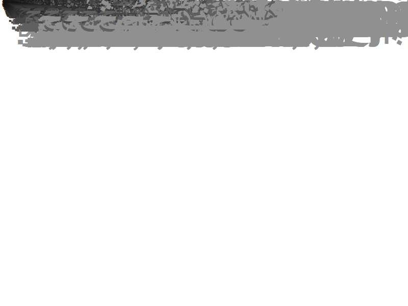

# Font loader for Microsoft DirectWrite

The loader is designed to load font files using the [DirectWrite](https://docs.microsoft.com/en-us/windows/win32/directwrite/direct-write-portal) interface (the engine used by all major Windows web browsers at the time of this writing), and test its rasterization code against potentially malformed input. The purpose of the program is to stress-test as much font-handling code as possible, and to execute it for all glyphs found in the font file instead of a limited charset such as just the ASCII characters.

The font-related DirectWrite calls made by the loader are listed below:

 - [IDWriteFactory::CreateFontFileReference](https://docs.microsoft.com/en-us/windows/win32/api/dwrite/nf-dwrite-idwritefactory-createfontfilereference)
 - [IDWriteFactory::CreateFontFace](https://docs.microsoft.com/en-us/windows/win32/api/dwrite/nf-dwrite-idwritefactory-createfontface)
 - [IDWriteFontFile::Analyze](https://docs.microsoft.com/en-us/windows/win32/api/dwrite/nf-dwrite-idwritefontfile-analyze)
 - [IDWriteFontFace::GetMetrics](https://docs.microsoft.com/en-us/windows/win32/api/dwrite/nf-dwrite-idwritefontface-getmetrics)
 - [IDWriteFontFace::GetDesignGlyphMetrics](https://docs.microsoft.com/en-us/windows/win32/api/dwrite/nf-dwrite-idwritefontface-getdesignglyphmetrics)
 - [IDWriteFontFace::GetGlyphIndices](https://docs.microsoft.com/en-us/windows/win32/api/dwrite/nf-dwrite-idwritefontface-getglyphindices)
 - [IDWriteFontFace1::GetUnicodeRanges](https://docs.microsoft.com/en-us/windows/win32/api/dwrite_1/nf-dwrite_1-idwritefontface1-getunicoderanges)
 - [IDWriteBitmapRenderTarget::DrawGlyphRun](https://docs.microsoft.com/en-us/windows/win32/api/dwrite/nf-dwrite-idwritebitmaprendertarget-drawglyphrun)

## Building

The application can be compiled with Microsoft Visual Studio after importing `ttf-otf-dwrite-loader.cpp` and `config.h` into a new project.

## Usage

Using the tool is as simple as passing the path of the tested TTF/OTF font in the first argument, for example:

```
c:\ttf-otf-dwrite-loader>ttf-otf-dwrite-loader.exe C:\Windows\Fonts\arial.ttf
[+] Input font is supported, with file type 2, face type 1 and number of faces 1
[+] Loaded 140 unicode ranges from the input font
[+] Font processing completed
[+] Font displayed without errors.

c:\ttf-otf-dwrite-loader>
```

In addition to the standard output, you should also observe the font's glyphs being drawn in the upper left corner of the screen:



During fuzzing, we recommend enabling [Page Heap](https://docs.microsoft.com/en-us/windows-hardware/drivers/debugger/gflags-and-pageheap) for the loader process, for better detection of out-of-bounds and uninitialized memory bugs.
