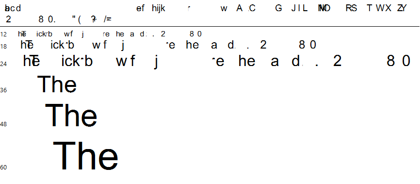

# TTF/OTF mutator

The mutator inserts random binary modifications into many of the supported TrueType and OpenType [SFNT tables](https://docs.microsoft.com/en-us/typography/opentype/spec/otff#font-tables), using several mutation algorithms and per-table mutation ratios. It preserves the basic structure of the files and fixes up the checksums, in order to pass basic sanity checks and consistently reach the deeper levels of font rasterization code.

The inner workings of the tool were discussed in detail in the [A year of Windows kernel font fuzzing #2](https://googleprojectzero.blogspot.com/2016/07/a-year-of-windows-kernel-font-fuzzing-2.html) blog post, but in summary, the supported mutation algorithms are _bitflipping_, _byteflipping_, _chunkspew_, _special ints_ and _binary arithmetic_. For each combination of `(table, algorithm)`, we estimated a mutation ratio such that when 10 tables are mutated in a font, it can be successfully loaded in Windows approximately 50% of the times. This left us with the following numbers:

**Table**|**Bitflipping**|**Byteflipping**|**Chunkspew**|**Special Ints**|**Binary arithmetic**
:-----:|:-----:|:-----:|:-----:|:-----:|:-----:
`hmtx`|0.1|0.8|0.8|0.8|0.8
`maxp`|0.009766|0.078125|0.125|0.056641|0.0625
`OS/2`|0.1|0.2|0.4|0.2|0.4
`post`|0.004|0.06|0.2|0.15|0.03
`cvt`|0.1|0.1|0.1|0.1|0.1
`fpgm`|0.01|0.01|0.01|0.01|0.01
`glyf`|0.00008|0.00064|0.008|0.00064|0.00064
`prep`|0.01|0.01|0.01|0.01|0.01
`gasp`|0.1|0.1|0.1|0.1|0.1
`CFF`|0.00005|0.0001|0.001|0.0002|0.0001
`EBDT`|0.01|0.08|0.2|0.08|0.08
`EBLC`|0.001|0.001|0.001|0.001|0.001
`EBSC`|0.01|0.01|0.01|0.01|0.01
`GDEF`|0.01|0.01|0.01|0.01|0.01
`GPOS`|0.001|0.008|0.01|0.008|0.008
`GSUB`|0.01|0.08|0.01|0.08|0.08
`hdmx`|0.01|0.01|0.01|0.01|0.01
`kern`|0.01|0.01|0.01|0.01|0.01
`LTSH`|0.01|0.01|0.01|0.01|0.01
`VDMX`|0.01|0.01|0.01|0.01|0.01
`vhea`|0.1|0.1|0.1|0.1|0.1
`vmtx`|0.1|0.1|0.1|0.1|0.1
`mort`|0.01|0.01|0.01|0.01|0.01

## Building

The program can be compiled with `g++` using `Makefile.linux` on Linux, with `mingw-g++` using `Makefile.mingw` on Windows, or with Microsoft Visual Studio, after having imported all of the source files into a new project.

## Usage

The usage of the tool is very simple:

```
c:\ttf-otf-mutator>mutator
Usage: mutator <input font> <output font>

c:\ttf-otf-mutator>
```

For example, to create a mutated `output.ttf` file based on `C:\Windows\Fonts\arial.ttf`, we can run the following command:

```
c:\ttf-otf-mutator>mutator C:\Windows\Fonts\arial.ttf output.ttf
[+] Ignoring table "DSIG"
[+] Mutating table "GDEF" of size 820
[+] Mutating table "GPOS" of size 73976
[+] Mutating table "GSUB" of size 27738
[+] Mutating table "JSTF" of size 30
[+] Mutating table "LTSH" of size 4241
[...]
[+] Ignoring table "loca"
[+] Mutating table "maxp" of size 32
[+] Ignoring table "meta"
[+] Ignoring table "name"
[+] Mutating table "post" of size 32
[+] Mutating table "prep" of size 3119
[+] Font successfully mutated and saved in "output.ttf".

c:\ttf-otf-mutator>
```

When opened in the default Windows Font Viewer, an example output font may look as follows:


