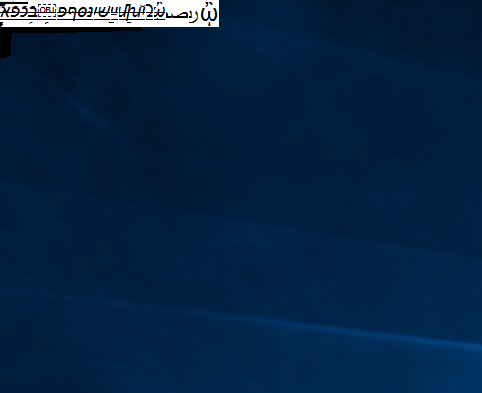

# Font loader for Windows

The loader is designed to temporarily install a specific font in Windows, and test the built-in rasterization code present in the operating system against the (potentially malformed) file. The purpose of the program is to stress-test as much font-handling code as possible, and to execute it for all glyphs found in the font file instead of a limited charset such as just the ASCII characters.

The font-related GDI calls made by the loader are listed below:

 - [AddFontResourceW](https://docs.microsoft.com/en-us/windows/desktop/api/wingdi/nf-wingdi-addfontresourcew)
 - [RemoveFontResourceW](https://docs.microsoft.com/en-us/windows/desktop/api/wingdi/nf-wingdi-removefontresourcew)
 - [GetFontResourceInfoW](http://www.undocprint.org/winspool/getfontresourceinfo)
 - [CreateFontIndirectW](https://docs.microsoft.com/en-us/windows/desktop/api/wingdi/nf-wingdi-createfontindirectw)
 - [GetKerningPairs](https://docs.microsoft.com/en-us/windows/desktop/api/wingdi/nf-wingdi-getkerningpairsa)
 - [GetFontUnicodeRanges](https://docs.microsoft.com/en-us/windows/desktop/api/wingdi/nf-wingdi-getfontunicoderanges)
 - [GetGlyphOutline](https://docs.microsoft.com/en-us/windows/desktop/api/wingdi/nf-wingdi-getglyphoutlinea)
 - [DrawTextW](https://docs.microsoft.com/en-us/windows/desktop/api/winuser/nf-winuser-drawtextw)

Furthermore, the program also invokes a number of Uniscribe API functions:

 - [ScriptCacheGetHeight](https://docs.microsoft.com/en-us/windows/desktop/api/usp10/nf-usp10-scriptcachegetheight)
 - [ScriptGetFontProperties](https://docs.microsoft.com/en-us/windows/desktop/api/usp10/nf-usp10-scriptgetfontproperties)
 - [ScriptGetGlyphABCWidth](https://docs.microsoft.com/en-us/windows/desktop/api/usp10/nf-usp10-scriptgetglyphabcwidth)
 - [ScriptGetCMap](https://docs.microsoft.com/en-us/windows/desktop/api/usp10/nf-usp10-scriptgetcmap)
 - [ScriptGetFontScriptTags](https://docs.microsoft.com/en-us/windows/desktop/api/usp10/nf-usp10-scriptgetfontscripttags)
 - [ScriptGetFontLanguageTags](https://docs.microsoft.com/en-us/windows/desktop/api/usp10/nf-usp10-scriptgetfontlanguagetags)
 - [ScriptGetFontFeatureTags](https://docs.microsoft.com/en-us/windows/desktop/api/usp10/nf-usp10-scriptgetfontfeaturetags)
 - [ScriptGetFontAlternateGlyphs](https://docs.microsoft.com/en-us/windows/desktop/api/usp10/nf-usp10-scriptgetfontalternateglyphs)
 - [ScriptSubstituteSingleGlyph](https://docs.microsoft.com/en-us/windows/desktop/api/usp10/nf-usp10-scriptsubstitutesingleglyph)

## Building

The application can be compiled with Microsoft Visual Studio after importing `ttf-otf-windows-loader.cpp` and `config.h` into a new project.

## Usage

Using the tool is as simple as passing the path of the tested TTF/OTF font in the first argument, for example:

```
c:\ttf-otf-windows-loader>ttf-otf-windows-loader.exe C:\Windows\Fonts\arial.ttf
[+] Extracted 1 logfonts.
[+] Installed 1 fonts.
[+] Starting to test font 1 / 1, variation 1 / 5
[+]   Getting kerning pairs
[+]   Getting unicode ranges
[+]   Getting glyph outlines and drawing them on screen
[+]   Testing the Uniscribe user-mode library
[+] Starting to test font 1 / 1, variation 2 / 5
[+]   Getting kerning pairs
[+]   Getting unicode ranges
[+]   Getting glyph outlines and drawing them on screen
[+]   Testing the Uniscribe user-mode library
[+] Starting to test font 1 / 1, variation 3 / 5
[+]   Getting kerning pairs
[+]   Getting unicode ranges
[+]   Getting glyph outlines and drawing them on screen
[+]   Testing the Uniscribe user-mode library
[+] Starting to test font 1 / 1, variation 4 / 5
[+]   Getting kerning pairs
[+]   Getting unicode ranges
[+]   Getting glyph outlines and drawing them on screen
[+]   Testing the Uniscribe user-mode library
[+] Starting to test font 1 / 1, variation 5 / 5
[+]   Getting kerning pairs
[+]   Getting unicode ranges
[+]   Getting glyph outlines and drawing them on screen
[+]   Testing the Uniscribe user-mode library

c:\ttf-otf-windows-loader>
```

In addition to the standard output, you should also observe the font's glyphs being drawn in the upper left corner of the screen:



When fuzzing fonts in Windows 7 and 8.1, we recommend enabling the [Special Pool](https://docs.microsoft.com/en-us/windows-hardware/drivers/devtest/special-pool) mechanism for the `win32k.sys` and `atmfd.dll` kernel modules. On Windows 10, it is a good idea to enable [Page Heap](https://docs.microsoft.com/en-us/windows-hardware/drivers/debugger/gflags-and-pageheap) for the `fontdrvhost.exe` process, as font processing was moved to user space in the latest version of the system.
